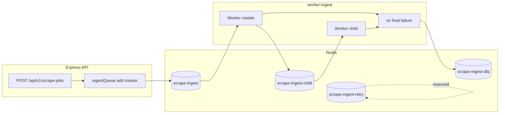

# Vahan360 — Architecture (repo snapshot)

This document describes the **current** monorepo layout, data boundaries, queue flow, security posture, and scaling notes. It complements `README.md` (how to run) and `docs/MIGRATION_AND_CLEANUP.md` (phased refactors).

## Implementation status (snapshot)

> Snapshot date: **2026-05-14** (align with `docs/ENTERPRISE_COMPLETION_CHECKLIST.md` when cutting a release PR).

The repo currently ships a working **ingest queue spine** (Express → BullMQ → worker, with DLQ/retry, HTTP replay, queue-depth metrics), an **Express → Nest `/api/v2` proxy** (optional `API_V2_PROXY_ENABLED`), **`apps/api-nest` as the default Helm `api` image** with **real Prisma reads** when **`INGEST_DATABASE_URL`** / **`DATABASE_URL`** are set (`not_implemented`-style responses mostly mean DB unset, not unmigrated stubs), **OpenTelemetry** with trace propagation across the API and worker, **structured JSON logs**, cookie-first auth (**Phase E-soft** Bearer deprecation in prod by default — [`SECURITY_ROADMAP_HTTPONLY.md`](docs/SECURITY_ROADMAP_HTTPONLY.md)), **Husky + lint-staged** pre-commit, **HTTP browser-manager lease service** (`apps/worker-ingest/src/browserManagerServer.js`) wired from Helm **`browserManager`** workload, **`KEDA`** `ScaledObject` templates (requires cluster-side KEDA operator), **Prometheus histogram + Grafana dashboards** + **Alertmanager** in **`deploy/compose/observability.docker-compose.yml`**, and **`docs/RUNBOOK_*.md`**. CI runs **`pnpm install` → `spybot_token` substring guard → `turbo lint` → bull-board smoke → `turbo build` → prisma validate → helm lint/template → Nest Docker build (no push)**.

Honest gaps that are **explicitly not finished** in this snapshot:

- **Bearer hard-removal (`Phase E-hard`)** — middleware still contains header paths behind `AUTH_ALLOW_BEARER`; login routes still emit dual `{ token }` JSON when cookies are set ([`SECURITY_ROADMAP_HTTPONLY`](docs/SECURITY_ROADMAP_HTTPONLY.md)).
- **Legacy `/api/selenium`** — optional Playwright path in `browserAutomationService.js`; **`puppeteer`** removed from `api-express`; frontend **does not** call legacy mount (**Helm defaults `LEGACY_PUPPETEER_ENABLED=false`**).
- **Portal fidelity at scale** — worker **`persistJobArtifacts.js`** parses and persists structured payloads, but **per-portal Playwright journeys** vary in maturity (**ENTERPRISE** checklist §4/§5).
- **Multi-replica browser-manager + per-tenant fairness** — HTTP lease manager ships; scaling / shared pools across replicas is documented as **⚠ backlog** (`deploy/runbooks/…`, checklist §8).
- **Full DB-backed RBAC matrix, org hierarchy tenancy, partitioning, read-replica routing** — slug tenancy + ingest `tenant_id` + Nest `TenantGuard` + role buckets (**ANALYST/OPS/ADMIN**) exist; deep org modelling + Express `v1` tenant parity remain ([`ENTERPRISE_COMPLETION_CHECKLIST`](docs/ENTERPRISE_COMPLETION_CHECKLIST.md) §3).
- **Image signing / SBOM**, **Vault-automated secrets**, optional **CSV/chart-heavy UI**, **production KEDA rollout** — still environment or product-owner dependent.

For the full per-block accounting (15 enterprise spec blocks × ✅ / 🟡 / ❌ × evidence paths × what remains), read:

- [`docs/ENTERPRISE_COMPLETION_CHECKLIST.md`](docs/ENTERPRISE_COMPLETION_CHECKLIST.md) — exhaustive per-block status table.
- [`docs/MIGRATION_AND_CLEANUP.md`](docs/MIGRATION_AND_CLEANUP.md) — phased Puppeteer / cookie / nginx / Mongo / Nest cleanup.
- [`docs/API_CONTRACTS.md`](docs/API_CONTRACTS.md) — Express `v1` vs Nest `v2` route tables.
- [`docs/SCALING_100X.md`](docs/SCALING_100X.md) — practical 100× scaling notes.
- [`docs/SECURITY_ROADMAP_HTTPONLY.md`](docs/SECURITY_ROADMAP_HTTPONLY.md) — JWT off `localStorage`; httpOnly cookies + CSRF (**E-soft ✅**, **E-hard** backlog).
- [`docs/PUPPETEER_SUNSET_PLAN.md`](docs/PUPPETEER_SUNSET_PLAN.md) — ordered steps to retire **`LEGACY_ROUTE_MOUNT=/api/selenium`** and trim **`playwright`** from `api-express`.

## Service map

| Component | Path / package | Role |
| --- | --- | --- |
| **Express API** | `apps/api-express/` (`@vahan360/api-express`; service `vahan360-api-express`) | Primary control plane: JWT auth, `POST /api/v1/scrape-jobs`, BullMQ enqueue, Bull Board, `/metrics`, legacy **`/api/selenium`** mount (historic name), Postgres `public` schema (users, khanan, vehicles). |
| **Nest API** | `apps/api-nest/` (`@vahan360/api-nest`) | **Helm chart `api` workload** — health, ingest/system reads, RBAC/me, OAuth-style cookie session via same JWT verification as Express (see roadmap). **`API_V2_PROXY_ENABLED`** routes `/api/v2/*` from Express → `NEST_INTERNAL_URL`; optional **`nest.enabled`** runs a **second** Nest pod (e.g. :4000) for split-topologies. |
| **Ingest worker** | `apps/worker-ingest` (`@vahan360/worker-ingest`) | BullMQ **master** + **child** workers; optional Playwright smoke; writes `ingest.*` + `system.*`; queue depth metrics. |
| **Next.js frontend** | `apps/web/` (`@vahan360/web`) | Dashboards, scrape console, login against Express. |
| **Shared packages** | `packages/*` | `contracts` (job types), `db` (Prisma multi-schema client for ingest/processed/system), `scraper-core` (selector YAML + Playwright smoke), `browser-pool` (context pool skeleton). |

**Repo convention:** runnable products live under `apps/*`, reusable workspace libraries live under `packages/*`, and Docker/Helm/Kubernetes assets live under `deploy/*` or root compose files. App folders use kebab-case and package names use the `@vahan360/*` scope.

**Infra (reference):** `docker-compose.yml` (Postgres 5433, Redis, `api-express`, nginx), `deploy/helm/vahan360` (single-namespace chart; optional Redis/worker/api/nest), `deploy/compose/observability.docker-compose.yml` (Loki, Jaeger, etc.).

## Data planes (Prisma)

Two Prisma entry points coexist by design:

1. **`apps/api-express/prisma`** — `public` schema: users, legacy Khanan/vehicle tables, JWT-backed app data. Client: `apps/api-express/src/db/prisma.js`.
2. **`packages/db/prisma/schema.prisma`** — PostgreSQL schemas **`ingest`**, **`processed`**, **`system`**: scrape jobs, job events, raw capture stubs, queue metrics, worker heartbeats. Client: `@vahan360/db/ingest-client` (`createIngestPrismaClient`).

Both can target the **same** database URL with different Prisma schemas applied (`pnpm` flows in root `README.md`).

## Queue architecture (BullMQ)

Default queue names (override with env):

| Queue | Env | Purpose |
| --- | --- | --- |
| Master | `INGEST_QUEUE_NAME` → `scrape-ingest` | One job per scrape job id; fans out child steps. |
| Child | `INGEST_CHILD_QUEUE_NAME` → `scrape-ingest-child` | `prepare` / `persist_stub_result` style steps. |
| DLQ | `INGEST_DLQ_QUEUE_NAME` → `scrape-ingest-dlq` | Terminal failures copied here when `INGEST_DLQ_ENABLED=true`. |
| Retry (reserved) | `INGEST_RETRY_QUEUE_NAME` → `scrape-ingest-retry` | Registered + metrics + Bull Board; **no default consumer** — for manual / future delayed retry fan-in. |

Producer: `apps/api-express/src/lib/ingestQueue.js` (`enqueueScrapeIngestJob`). Consumer + DLQ: `apps/worker-ingest/src/index.js`.

**Stuck jobs:** Worker `lockDuration` / `stalledInterval` are configurable via `BULLMQ_LOCK_DURATION_MS` and `BULLMQ_STALLED_INTERVAL_MS` (see worker `.env.example`).

## Security posture

**Current (as implemented — 2026-05):**

- **Browser dashboard auth:** cookie session — **`spybot_access`** (httpOnly) + **`spybot_refresh`** (httpOnly) + readable **`spybot_csrf`**; Next uses `credentials: 'include'` + `X-CSRF-Token` (see [`docs/SECURITY_ROADMAP_HTTPONLY.md`](docs/SECURITY_ROADMAP_HTTPONLY.md)). The SPA **does not** persist the access JWT in `localStorage` for login.
- **`Authorization: Bearer`** on Express `/api/v1/*` is **disallowed in production by default** (`AUTH_ALLOW_BEARER`; 401 `bearer_deprecated`). Non-prod / break-glass: set **`AUTH_ALLOW_BEARER=true`** so scripts can still send Bearer. **Hard removal** of header parsing is a later **Phase E-hard** backlog item (same roadmap doc).
- **Helmet** on Express with API-friendly CSP (tunable via `HELMET_DISABLE_CSP` for dev proxies / SSE).
- CORS allow-list (`CORS_ORIGIN` / `CORS_ORIGIN_ALLOWLIST`); rate limits on scrape enqueue + optional global cap.
- `/metrics` and Nest proxy paths should stay on **private** networks.
- **Bull Board** requires auth (JWT via cookie-capable browser or scripted Bearer when Bearer is explicitly allowed).

**Enterprise stretch goals:** Vault / sealed secrets for credentials, stronger network policies, optional mTLS, broader audit writes on admin paths (`system.audit_logs` exists — see ingest schema).

## Scaling notes

- **Horizontally:** Run multiple `worker-ingest` replicas with the same Redis queue names; BullMQ coordinates locks. Tune `INGEST_WORKER_CONCURRENCY`, `INGEST_CHILD_CONCURRENCY`, Playwright/browser pool separately from API replicas.
- **Postgres:** Ingest writes are append-heavy (`job_events`); index on `(job_id, occurred_at)` supports tail reads. Queue metrics sampling interval trades DB write load vs freshness (`QUEUE_METRICS_INTERVAL_MS`).
- **Redis:** Single Redis is the usual bottleneck for queue depth; consider Redis Cluster / managed Redis for large fan-out.
- **Observability:** Backend `/metrics`; worker optional `METRICS_ENABLED` + `WORKER_METRICS_PORT`; OTLP traces optional on both.

## Frontend ↔ API v2

The Next app uses **`NEXT_PUBLIC_API_BASE_URL`**. Authed **`fetch`** uses **`credentials: 'include'`** and the **`spybot_csrf`** cookie for **`X-CSRF-Token`** — **not** a manually attached Bearer header for normal UI traffic. Nested **`/api/v2/*`** flows may ride the Express gateway; when **`API_V2_PROXY_ENABLED`** is on, upstream cookies can be synthesized into Bearer for Nest (see [`apps/api-express/src/app.js`](apps/api-express/src/app.js) proxy).

When **`API_V2_PROXY_ENABLED`** is set on Express, **`GET /api/v2/vehicle/{regNorm}/summary`** is rewritten and forwarded to Nest **`GET /vehicle/:regNorm/summary`** (stub response until DB is wired). Controller: `apps/api-nest/src/vehicle.controller.ts`.

- **`GET /api/v2/compliance/summary`** → Nest **`GET /compliance/summary`** (optional `district` query reserved; stub JSON until wired). Module: `apps/api-nest/src/compliance.module.ts`.
- **`GET /api/v2/trips/summary`** → Nest **`GET /trips/summary`** (optional `from` / `to` queries documented only; stub `{ status, asOf }` until wired). Module: `apps/api-nest/src/trips.module.ts`.
- **`GET /api/v2/consigners/summary`** → Nest **`GET /consigners/summary`** (same optional range queries + stub shape). Module: `apps/api-nest/src/consigners.module.ts`.
- **`GET /api/v2/selectors/health`** → Nest **`GET /selectors/health`** — read-only JSON `{ portals, versionHints }` from `@vahan360/scraper-core` `getSelectorRegistry` (bundled YAML; no Playwright). Module: `apps/api-nest/src/selectors.module.ts`.
- **`GET /api/v2/permits/expiring`** → Nest **`GET /permits/expiring`** (optional `days` query, default 30, clamped 1–365; stub `{ status, asOf, days }` until wired). Module: `apps/api-nest/src/permit.module.ts`.
- **`GET /api/v2/insurance/expiring`** → Nest **`GET /insurance/expiring`** (same `days` shape + stub). Module: `apps/api-nest/src/insurance.module.ts`.

## Optional Redis cache (Express)

`apps/api-express` ships a tiny opt-in cache helper at `src/lib/redisCache.js` for hot read paths:

- Activation: **`REDIS_CACHE_ENABLED=true`** AND one of `REDIS_URL` / `BULLMQ_REDIS_URL` is set; otherwise no-op (fresh reads).
- Currently wraps **`GET /api/v1/queues/metrics`** with **TTL 5s** keyed by `path + clamped limit`.
- Response exposes `x-cache: hit|miss|disabled` for ops debug.
- Failure model: Redis errors silently downgrade to a miss; the route always serves fresh data on cache outage. Connection uses `commandTimeout: 200ms`, `enableOfflineQueue: false`, `maxRetriesPerRequest: 1` so a degraded Redis can never wedge the API thread.

## Browser-manager (Helm, Phase 1)

`deploy/helm/vahan360/templates/deployment-browser-manager.yaml` ships an optional Deployment (+ Service) for a forthcoming browser-manager service. Default `values.browserManager.enabled: false`. When enabled, it reuses the **worker image** and runs a tiny Node HTTP `ok` server (`node -e "require('http').createServer((q,s)=>{s.end('ok')}).listen(3005)"`) on `:3005` until the real binary lands. Override `browserManager.image.*` to point at a dedicated repo, and replace `browserManager.command` with the real entrypoint when wiring.

## Related docs

- `README.md` — env table, curl examples, local bootstrap.
- `docs/ENTERPRISE_COMPLETION_CHECKLIST.md` — exhaustive per-block ✅ / 🟡 / ❌ status with evidence paths.
- `docs/MIGRATION_AND_CLEANUP.md` — phased checklist (legacy in-API browser automation sunset, cookie auth, nginx, Mongo grep, Nest `/api/v2`).
- `docs/API_CONTRACTS.md` — Express `v1` vs Nest `v2` route tables (method, path, auth notes).
- `docs/SCALING_100X.md` — practical scaling bullets (DB, Redis, queues, HPA, browsers, cost).
- `docs/SECURITY_ROADMAP_HTTPONLY.md` — httpOnly cookie session + CSRF + **Phase E-soft** Bearer deprecation (**E-hard** backlog itemized in doc).
- `docs/PUPPETEER_SUNSET_PLAN.md` — ordered legacy **`/api/selenium`** + **`playwright`** (in-API) retirement steps.
- `deploy/k8s/namespaces-example.yaml` — optional multi-namespace layout (chart remains single-namespace compatible).
