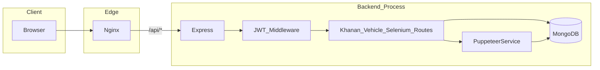

# Vahan360 / Spybot — Senior Architecture & Security Audit

This document records an evidence-based architectural, security, and engineering audit of the Spybot/Vahan360 monorepo (Next.js frontend + Express/MongoDB backend + nginx + Docker). Paths below are relative to the repository root unless noted.

---

## 1. PROJECT PURPOSE

**What it does (evidence):** The repo is positioned as a **migration from Java Spring Boot** to **Node/Express + Next.js**, centered on **scraping and storing “Khanan” (mineral transport) data** from the Bihar government portal (`khanansoft.bihar.gov.in`), exposing **REST APIs** for analytics and **vehicle trip / lead summaries** for operational dashboards ([README.md](../README.md), [backend/src/services/puppeteerService.js](../backend/src/services/puppeteerService.js)).

**Business problem:** Automate collection of e‑pass / mineral movement records and related vehicle intelligence so teams can **analyze leads, pipeline stages, and scraping runs**—aligned with dashboard routes such as Leads, Pipeline, Khanan Soft ([frontend/src/components/Sidebar.tsx](../frontend/src/components/Sidebar.tsx)).

**Users:** **Internal operators / analysts** (dashboard UX, scraping triggers, vehicle CRM-style fields—not a public consumer app). User model includes `roles` ([backend/src/models/User.js](../backend/src/models/User.js)) but **no route-level RBAC** was found in mounted middleware (only JWT auth on protected API prefixes).

---

## 2. TECH STACK ANALYSIS

| Layer | Technologies | Why (inferred) | Notes |
|-------|----------------|-----------------|-------|
| Monorepo | pnpm workspace + Turbo ([package.json](../package.json), [pnpm-workspace.yaml](../pnpm-workspace.yaml)) | Parallel dev/build across packages | Turbo pipeline minimal ([turbo.json](../turbo.json)); no advanced caching inputs declared |
| Frontend | Next.js (App Router), React 19, TypeScript, Tailwind v4 ([frontend/package.json](../frontend/package.json)) | SPA/dashboard with server-capable stack | **Heavy pages are client-only** (`'use client'` on large dashboard files) |
| Backend | Express, Mongoose, Puppeteer, Helmet, compression, express-rate-limit ([backend/package.json](../backend/package.json)) | REST + Mongo + headless scraping | **Rate limit middleware instantiated but not applied** ([backend/src/app.js](../backend/src/app.js) lines 27–31) |
| DB | MongoDB via Mongoose ([backend/src/app.js](../backend/src/app.js)) | Flexible schema for scraped rows + summaries | **Date modeled as display strings** on Khanan rows ([backend/src/models/KhananData.js](../backend/src/models/KhananData.js)) |
| Proxy | nginx alpine ([docker-compose.yml](../docker-compose.yml), [nginx/nginx.conf](../nginx/nginx.conf)) | TLS termination, rate limits, `/api` proxy | **Config assumes static HTML at `/`**, not Next |

**Overlapping / inconsistent docs:** README lists Docker services (frontend, mongo) that are **commented out or unused** in compose ([docker-compose.yml](../docker-compose.yml)); README “migration complete / microservices” language conflicts with **single-process Express + in-process scraper** reality.

**Dependency risk:** Default/fallback **JWT secret embedded in source** ([backend/src/routes/auth.js](../backend/src/routes/auth.js), [backend/src/middleware/auth.js](../backend/src/middleware/auth.js)) — critical if env not set in production.

---

## 3. ARCHITECTURE ANALYSIS

**Overall:** **modular monolith**: Express app mounts route modules; Puppeteer scraping runs **inside the API process** as a singleton service ([backend/src/services/puppeteerService.js](../backend/src/services/puppeteerService.js)); aggregation utilities bridge Khanan → Vehicle summaries ([backend/src/utils/vehicleAggregator.js](../backend/src/utils/vehicleAggregator.js)).

**Patterns:** Classic **Express Router** modules; **Repository-like** access via Mongoose models directly in routes (thin separation—**business logic split** between routes and `utils/`). **JWT + tokenVersion** for session invalidation on new login ([backend/src/middleware/auth.js](../backend/src/middleware/auth.js)).

**Coupling / inconsistency:**

- **Dual mount** of auth: `/api/auth` and `/auth` ([backend/src/app.js](../backend/src/app.js)) increases surface and confusion.
- **nginx** defines `upstream frontend { server frontend:3000; }` but **frontend service is disabled** in compose—dead configuration if someone re-enables routes relying on that upstream ([nginx/nginx.conf](../nginx/nginx.conf), [docker-compose.yml](../docker-compose.yml)).
- **Deployment story split:** Docker serves **legacy static UI** from nginx `root`, while Next app is documented for dev—**two frontends** unless deliberately unified.

---

## 4. FOLDER STRUCTURE AUDIT

- **Root:** Clear split `frontend/`, `backend/`, `nginx/` — sensible.
- **Scaling concerns:** Several **very large** client components (e.g. [frontend/src/app/dashboard/leads/page.tsx](../frontend/src/app/dashboard/leads/page.tsx) ~1100+ lines) — hard to test and review.
- **Naming:** `failed-vechiles` route typo ([frontend/src/components/Sidebar.tsx](../frontend/src/components/Sidebar.tsx)); README footer `# Vahan360` vs project name “Spybot” — **branding/path drift**.
- **Duplication:** Same `API_BASE_URL` and `SPRING_STATUS_TO_PIPELINE` maps repeated across pages instead of a single module; git status may show optional `frontend/src/lib/*` helpers — verify workspace contents.

---

## 5. FRONTEND AUDIT

- **Rendering:** App Router with **`AppShell` wrapping all routes** ([frontend/src/app/layout.tsx](../frontend/src/app/layout.tsx)); primary dashboards are **`'use client'`** with large local state—**minimal RSC benefit** on heavy pages.
- **State:** Local React state + `localStorage` for token ([frontend/src/app/login/page.tsx](../frontend/src/app/login/page.tsx), [frontend/src/components/AppShell.tsx](../frontend/src/components/AppShell.tsx)) — **no global store**; acceptable complexity-wise but **token sync is fragile** (shell redirect race handled via loading blank screen).
- **Routing:** `/` redirects to `/login` ([frontend/src/app/page.tsx](../frontend/src/app/page.tsx)); dashboard under `/dashboard/*`.
- **Auth UX:** **Client-only gate** via token presence—**no server-side session**; deep linking to protected routes still passes through client check.
- **Re-render / perf risks:** Large tables/filters in one component encourage **expensive re-renders**; repeated `fetch` per tab change without shared cache ([frontend/src/app/dashboard/pipeline/page.tsx](../frontend/src/app/dashboard/pipeline/page.tsx)).
- **UI patterns:** Decorative header search **not wired** to data ([frontend/src/components/AppShell.tsx](../frontend/src/components/AppShell.tsx)) — UX debt.

---

## 6. BACKEND AUDIT

- **API shape:** RESTful GET/POST under `/api/khanan`, `/api/vehicle`, `/api/selenium` with shared `authMiddleware` ([backend/src/app.js](../backend/src/app.js)).
- **Controllers/services:** Logic lives in **route handlers + utils** (e.g. vehicle upsert + lifecycle in [backend/src/routes/vehicle.js](../backend/src/routes/vehicle.js)); **no dedicated service layer** — workable at small scale, brittle as rules grow.
- **Validation:** Minimal—mostly presence checks; **large POST bodies** trust client shape ([backend/src/routes/vehicle.js](../backend/src/routes/vehicle.js)).
- **Business leakage:** Lifecycle rules duplicated conceptually with frontend status maps (`SPRING_STATUS_TO_PIPELINE` vs `leadLifecycle.js`).
- **Scraper triggers:** `GET /api/selenium/by-date-range` **fires async work and returns immediately** ([backend/src/routes/selenium.js](../backend/src/routes/selenium.js)) — no durable job queue evidenced in repo.

---

## 7. DATABASE AUDIT

- **KhananData:** String `date`, indexes on `district+date`, **unique `challanNo`** ([backend/src/models/KhananData.js](../backend/src/models/KhananData.js)) — helps dedupe but **duplicate handling depends on scraper**.
- **VehicleTripSummary:** Rich indexing for CRM-style queries ([backend/src/models/VehicleTripSummary.js](../backend/src/models/VehicleTripSummary.js)).
- **Query risks:** Date filtering builds **`$in` with every formatted date string** in range ([backend/src/routes/khanan.js](../backend/src/routes/khanan.js)) — for **long ranges**, query documents grow large (performance + BSON size concerns).
- **Normalization:** Operational **denormalized summary** table vs raw Khanan—appropriate for reporting; risk is **staleness** unless sync discipline is enforced (`POST /api/vehicle/sync` exists — [backend/src/routes/vehicle.js](../backend/src/routes/vehicle.js)).

---

## 8. AUTHENTICATION & SECURITY AUDIT

| Topic | Finding | Evidence |
|-------|---------|----------|
| JWT storage | **Browser `localStorage`** | [frontend/src/app/login/page.tsx](../frontend/src/app/login/page.tsx) |
| Secret handling | **Production:** `JWT_SECRET` required (≥32 chars); dev fallback only when `NODE_ENV`≠`production` ([backend/src/config/jwtSecret.js](../backend/src/config/jwtSecret.js)) | [backend/src/routes/auth.js](../backend/src/routes/auth.js), [backend/src/middleware/auth.js](../backend/src/middleware/auth.js) |
| Token revocation | **tokenVersion bump on login** | [backend/src/routes/auth.js](../backend/src/routes/auth.js) — good pattern |
| Registration | **`POST register-user` appears unauthenticated** | [backend/src/routes/auth.js](../backend/src/routes/auth.js) — **account enumeration / open signup risk** |
| CORS | **`app.use(cors())` — effectively open** | [backend/src/app.js](../backend/src/app.js) |
| Rate limiting | **Limiter commented out** | [backend/src/app.js](../backend/src/app.js) |
| Error disclosure | **`details: error.message`** on many routes | e.g. [backend/src/routes/khanan.js](../backend/src/routes/khanan.js), [backend/src/routes/vehicle.js](../backend/src/routes/vehicle.js) |
| Regex injection / ReDoS | **Multiple `new RegExp(queryParam)` without escaping** user-supplied query strings | [backend/src/utils/vehicleQueryBuilder.js](../backend/src/utils/vehicleQueryBuilder.js) (contrast with `escapeRegex` used only in some paths) |

**nginx:** rate limiting zones exist for `/api/` ([nginx/nginx.conf](../nginx/nginx.conf)) — partial mitigation **if** nginx is always fronting the API.

---

## 9. PERFORMANCE AUDIT

- **Scraper:** Long-lived Puppeteer loops, periodic browser reset ([backend/src/services/puppeteerService.js](../backend/src/services/puppeteerService.js)) — **CPU/memory intensive**; **single-flight** `isProcessing` gate prevents overlap but **blocks concurrent scheduling**.
- **Aggregation sync:** `aggregateVehicles` loops **per-vehicle `findOneAndUpdate`** ([backend/src/utils/vehicleAggregator.js](../backend/src/utils/vehicleAggregator.js)) — **O(n) round trips** to DB.
- **Frontend:** Large client bundles/pages; **no obvious data virtualization** inferred from structure alone.
- **Caching:** No application-level cache layer identified; **gzip** at nginx and Express compression enabled.

---

## 10. CODE QUALITY AUDIT

- **Strengths:** Focused **pure helpers** with tests present for some utils (`vehicleQueryBuilder`, `leadLifecycle` under [backend/src/utils/__tests__/](../backend/src/utils/__tests__/)).
- **Debt:** Duplicated constants frontend/backend; **god-page** React files; typo routes; README claims **frontend tests and e2e** but root scripts only run `turbo run test` and **frontend `package.json` has no `test` script** ([frontend/package.json](../frontend/package.json)) — **documentation incorrect**.
- **Dead / misleading:** `limit_req zone=scraping` in nginx appears **unused** in shown config ([nginx/nginx.conf](../nginx/nginx.conf)).

---

## 11. DEVOPS & DEPLOYMENT AUDIT

- **Docker:** Backend image uses Chromium system deps ([backend/Dockerfile](../backend/Dockerfile)); compose maps **3001** and expects env vars ([docker-compose.yml](../docker-compose.yml)).
- **Mismatch:** README Quick Start references **`backend/.env.example`**; repository may use **`backend/env.example`** — **onboarding friction / path inconsistency** (verify on disk).
- **CI/CD:** **No `.github/workflows`** found in workspace — **no automated pipeline evidenced**.
- **SSL:** nginx listens on 443 with ssl volume mount implied; certificate validity **not verified** in this audit.

---

## 12. DEVELOPER EXPERIENCE AUDIT

- **Positives:** pnpm workspace, Turbo dev parallel, env modes for scraping documented ([README.md](../README.md)).
- **Friction:** Multiple sources of truth for ports (5000 default in code vs 3001 in Docker vs nginx upstream); README paths (`spybot-nextjs/`) vs actual folder names; missing unified API client file despite duplication.

---

## 13. FINAL AUDIT REPORT

### Executive summary

Yeh project **internal mineral-logistics intelligence dashboard** hai jiska core **Puppeteer-based scraping + MongoDB + Express APIs** hai. Architecture **simple aur ship karne-layak** hai for a small team, lekin **production security defaults** (JWT fallback, open CORS, auth routes exposure, regex-heavy queries) aur **deploy/README drift** (nginx static vs Next, compose vs docs) **serious operational risk** ban sakte hain. Scraper ko **same Node process** mein run karna horizontal scaling ko mushkil banata hai.

### Architecture summary

**Monolithic Express + embedded scraper + Mongoose**, Next.js dashboard for operators, optional nginx reverse proxy; **not** decomposed microservices despite README wording.

### Top 10 critical issues

1. **Hardcoded JWT secret fallback** in auth routes and middleware ([backend/src/routes/auth.js](../backend/src/routes/auth.js)).
2. **Open CORS** globally ([backend/src/app.js](../backend/src/app.js)).
3. **Unauthenticated user registration** endpoint unless gated externally ([backend/src/routes/auth.js](../backend/src/routes/auth.js)).
4. **Express rate limit disabled** ([backend/src/app.js](../backend/src/app.js)).
5. **User-controlled regex** in Mongo queries → **ReDoS / unexpected matches** ([backend/src/utils/vehicleQueryBuilder.js](../backend/src/utils/vehicleQueryBuilder.js)).
6. **JWT in localStorage** — XSS becomes session compromise ([frontend/src/app/login/page.tsx](../frontend/src/app/login/page.tsx)).
7. **Scraper co-located with API** — resource contention and scaling ceiling ([backend/src/services/puppeteerService.js](../backend/src/services/puppeteerService.js)).
8. **Docker/nginx/Next mismatch** — compose disables frontend; nginx still defines frontend upstream; `/` serves static HTML ([docker-compose.yml](../docker-compose.yml), [nginx/nginx.conf](../nginx/nginx.conf)).
9. **Error `details` leakage** to clients on failures ([backend/src/routes/khanan.js](../backend/src/routes/khanan.js)).
10. **README/testing claims** vs actual scripts (no CI, frontend test script missing) ([README.md](../README.md), [frontend/package.json](../frontend/package.json)).

### Top 10 strengths

1. **tokenVersion** invalidation pattern for JWT reuse ([backend/src/middleware/auth.js](../backend/src/middleware/auth.js)).
2. **Mongoose indexes** on hot fields ([backend/src/models/KhananData.js](../backend/src/models/KhananData.js), [backend/src/models/VehicleTripSummary.js](../backend/src/models/VehicleTripSummary.js)).
3. **Helmet + compression** middleware ([backend/src/app.js](../backend/src/app.js)).
4. **Lifecycle / aggregation helpers** extracted with tests ([backend/src/utils/leadLifecycle.js](../backend/src/utils/leadLifecycle.js)).
5. **Dockerfile non-root user** for backend ([backend/Dockerfile](../backend/Dockerfile)).
6. **Mongo DNS workaround** documented for Windows SRV issues ([backend/src/app.js](../backend/src/app.js)).
7. **nginx rate limiting** for `/api` when used ([nginx/nginx.conf](../nginx/nginx.conf)).
8. **Clear domain modeling** for vehicle CRM fields ([backend/src/models/VehicleTripSummary.js](../backend/src/models/VehicleTripSummary.js)).
9. **pnpm + Turbo monorepo** baseline ([package.json](../package.json)).
10. **Scraper operational safeguards** (single-run guard, browser lifecycle cleanup) ([backend/src/services/puppeteerService.js](../backend/src/services/puppeteerService.js)).

### Technical debt assessment

**High:** duplicated frontend constants, oversized pages, docs/deploy inconsistencies, weak input sanitization on search APIs, no evidenced CI.

### Security assessment

**Below production bar** without mandatory env secrets, CORS lockdown, rate limits, regex hardening, and registration policy—**severity depends on exposure** (internal VPN vs public internet).

### Scalability assessment

**Vertical scaling primarily**; scraper-in-process and sequential DB updates limit throughput; multi-instance API **without sticky scraper coordination** would be unsafe unless scraping is isolated.

### Scores (1–10; evidence-based judgment)

| Metric | Score | Rationale |
|--------|-------|-----------|
| **Maintainability** | **4/10** | Large client files, duplication, naming drift, doc mismatches |
| **Architecture quality** | **5/10** | Clear layering for size, but coupling + deployment inconsistencies |
| **Production readiness** | **3/10** | Security defaults + deploy/docs gaps + missing CI |

---

### Uncertainties (explicit)

Network exposure assumptions; MongoDB Atlas hardening; completeness of untracked files in git status (`queue`, `env.example` naming); whether nginx static bundle is still the primary UI in production—**verify in deployment environment**.
